<h1 align="center">👋 Junior Software Quality Analyst | QA Automation Tester</h1>

  

---

<!-- LOCAL CITY-POP BANNER -->
<a href="https://github.com/macu-dev">
  <picture>
    <source media="(prefers-color-scheme: dark)" srcset="assets/banner-dark.v9.svg">
    <source media="(prefers-color-scheme: light)" srcset="assets/banner-light.v9.svg">
    
  </picture>
</a>

 

---

  

 

---
<table border="1" cellpadding="14" bgcolor="#17171c">
  <thead>
    <tr>
      <th colspan="2" align="left"><code>macu-dev:~$ cat tech-stack.yaml</code></th>
    </tr>
  </thead>
  <tbody>
    <tr>
      <td width="50%" valign="top"><code>├─ ☁ cloud_infrastructure:</code>  
         
        <code>AWS · Azure · Ansible</code>
      </td>
      <td width="50%" valign="top"><code>├─ ▣ databases_messaging:</code>  
        
         
        <code>Amazon RDS · MySQL · PostgreSQL · MongoDB · DynamoDB</code>
      </td>
    </tr>
    <tr>
      <td valign="top"><code>├─ ⚙ containers_ci_cd:</code>  
         
        <code>Kubernetes · Docker · GitHub Actions · GitLab CI · Bitbucket · Bash</code>
      </td>
      <td valign="top"><code>├─ ◉ monitoring_observability:</code>  
        
        
         
        <code>Sentry · Prometheus · Datadog · Amazon CloudWatch</code>
      </td>
    </tr>
    <tr>
      <td valign="top"><code>├─ ✦ languages_frameworks:</code>  
         
        <code>Node.js · JavaScript · React · Next.js · TypeScript · Python · FastAPI</code>
      </td>
      <td valign="top"><code>╰─ ⌁ security_iac:</code>  
        
        
        
        
         
        <code>Trivy · SonarQube · Terraform · Cilium · Falco</code>
      </td>
    </tr>
  </tbody>
  <tfoot>
    <tr>
      <td colspan="2"><code>status: ready&nbsp;&nbsp;·&nbsp;&nbsp;environment: production</code></td>
    </tr>
  </tfoot>
</table>

---

# 💫 About Me

I am a Junior Software Quality Analyst passionate about software testing, quality assurance, and continuous learning.

I have experience in manual testing, automated testing, API testing, bug reporting, and validation of business requirements.

Currently studying Software Engineering and improving my QA Automation skills using modern testing tools and frameworks.

- 🔍 Passionate about Software Quality Assurance
- 🚀 Interested in QA Automation and Web Testing
- 🤝 Teamwork and collaborative mindset
- 📚 Continuous learner and self-taught developer
- 🌎 B1 English certified | Currently studying B2
- ⚡ Motivated by challenges and problem solving

---

# 🧪 QA & Testing Tools

---

# 💻 Development Tools

---

# 📚 Currently Learning

- Advanced QA Automation
- API Testing
- Playwright Framework
- Performance Testing
- Software Testing Best Practices

---

# 📫 Connect With Me

- LinkedIn: www.linkedin.com/in/marithza-castaño-paniagua-713415276
- Email: marithzacastano9.5@gmail.com
